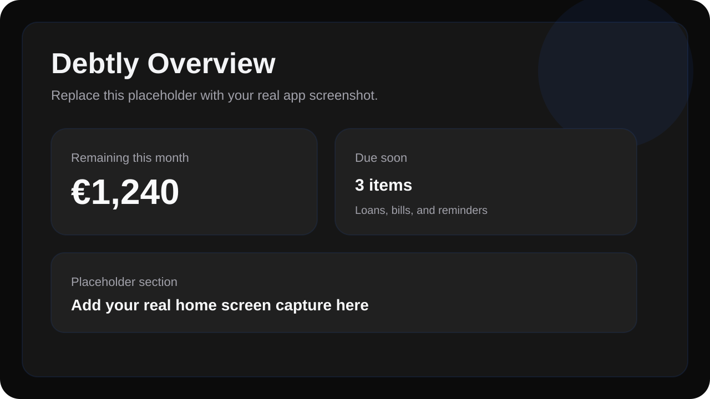
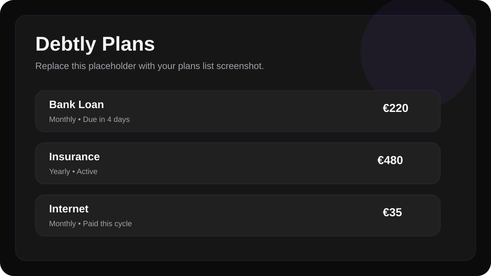
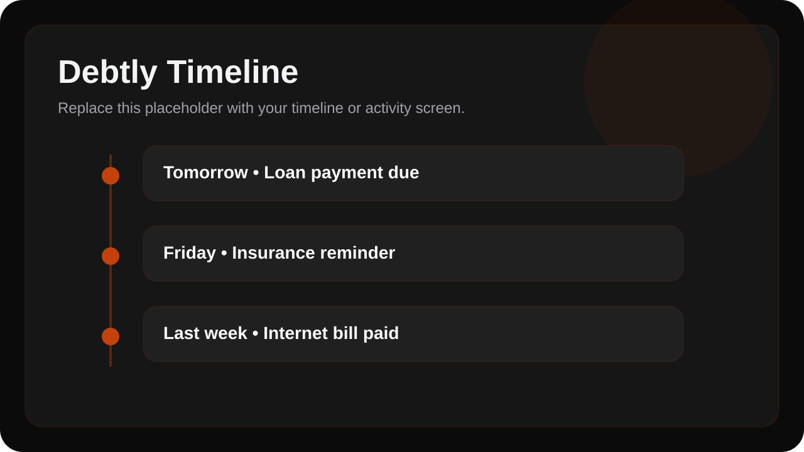
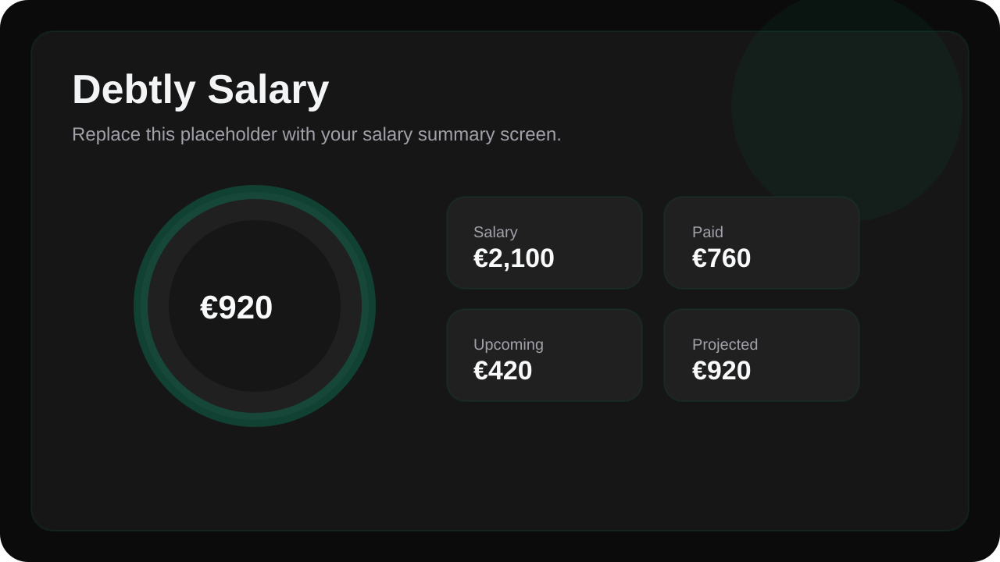

# Debtly

Debtly is an offline-first Flutter app for tracking personal debts, recurring
payments, installment plans, bills, due dates, reminders, and salary impact in
one place.

It is designed as a focused personal finance utility, not a full accounting
system. The goal is simple: know what is due, what was paid, what is overdue,
and how much money is left for the month.

## Why Debtly Exists

Most people do not need a heavy budgeting suite to follow a few loans,
subscriptions, family obligations, and monthly payments. Debtly is built for
that narrower problem:

- follow debts and recurring obligations clearly
- mark payments without losing history
- see due, overdue, and upcoming items fast
- understand monthly salary impact
- get reminders locally without depending on a backend

## Screenshots

Temporary placeholders are included below. Replace these image files later with
your own app screenshots:

- `assets/readme/overview_placeholder.svg`
- `assets/readme/plans_placeholder.svg`
- `assets/readme/timeline_placeholder.svg`
- `assets/readme/salary_placeholder.svg`

### Overview



### Plans



### Timeline



### Salary



## Core Features

- offline-first local data storage
- debts, obligations, subscriptions, and one-time expenses
- recurring plans:
  - one time
  - monthly
  - yearly
  - custom interval
- partial payments and payment history
- due, upcoming, overdue, completed, and closed states
- salary-aware monthly balance tracking
- negative balance support when spending exceeds salary
- local reminders with no backend
- backup export and local reset tools
- premium dark-mode UI with selectable accent themes

## How It Works

Debtly separates plans from payment cycles and payment records. That makes the
app more reliable for recurring financial data:

- a recurring plan stays intact over time
- each due cycle can be tracked independently
- payments can be partial or complete
- reminders can be recalculated after edits
- salary summaries are computed from real stored data

The local SQLite data model includes:

- `plans`
- `occurrences`
- `payments`
- `reminders`
- `salary_configs`
- `settings`

## Product Direction

Debtly is built as a calm, premium personal utility:

- dark-only UI
- focused information hierarchy
- minimal clutter
- strong daily usability
- local-first by default
- no demo data on first launch

## Security Posture

Debtly has a low remote attack surface. It has:

- no backend
- no cloud sync
- no user accounts
- no access to contacts, SMS, microphone, camera, or location

The realistic risk is local privacy exposure if the device itself is compromised
or if exported backup files are handled carelessly. Debtly is a local utility
app, not a connected data platform.

## Tech Stack

- Flutter
- Riverpod
- SQLite via `sqflite`
- local notifications via `flutter_local_notifications`
- timezone-aware scheduling via `timezone` and `flutter_timezone`

## Project Structure

```text
lib/src/
  app/            app shell and navigation
  application/    controller/providers
  core/           theme, tokens, reusable widgets, helpers
  data/           SQLite setup and repository implementation
  domain/         models and business services
  features/       Overview, Plans, Timeline, Salary, Settings
```

## Notification Support

Debtly uses local notifications only.

Implemented:

- runtime notification permission requests
- Android exact alarm handling
- scheduled local reminders
- notification tap routing back into the app
- hidden internal debug tools for notification testing

Current platform status:

- Android support is actively tested
- iOS support exists in code, but still needs real-device verification

## Getting Started

### Requirements

- Flutter SDK
- Dart SDK
- Android SDK for Android builds
- macOS + Xcode if you want to build for iPhone

### Run the App

From the project root:

```bash
flutter pub get
flutter run
```

### Analyze the Project

```bash
flutter analyze
```

## Build for Android

Standard release APK:

```bash
flutter build apk --release
```

Smaller split APKs by CPU architecture:

```bash
flutter build apk --release --split-per-abi
```

Play Store bundle:

```bash
flutter build appbundle --release
```

## Build for iPhone

You cannot build iPhone binaries from Linux.

To build for iPhone you need:

- macOS
- Xcode
- Apple signing and provisioning

## Local Data, Backup, and Reset

Debtly stores all user data locally on the device.

Available from the app:

- export a local backup
- reset all local app data

Available from the OS:

- clear app data
- uninstall the app

## Current Status

Working well:

- offline-first storage
- debt and recurring payment tracking
- payment history and partial payments
- salary summary
- Android local notifications
- premium dark UI with accent themes

Still worth validating on real hardware:

- iOS notification delivery
- iOS notification tap routing
- layout behavior across multiple iPhone sizes

## Contributing

Debtly is source-visible and contribution-friendly, but it is not open source.

You may:

- review the code
- run the project locally
- propose fixes and improvements
- submit pull requests

You may not:

- reuse this code in another app or service
- redistribute the codebase
- publish modified copies
- sell, sublicense, or white-label the project

If you contribute:

1. run `flutter pub get`
2. run `flutter analyze`
3. test on Android first
4. verify notifications on a real device
5. add SQLite migrations for any persisted schema change

See [CONTRIBUTING.md](CONTRIBUTING.md) for the contribution policy.

## License

This project is proprietary and all rights are reserved.

Source code is visible for review and contribution purposes only. Reuse,
redistribution, and derivative use require prior written permission from the
author.

See [LICENSE](LICENSE) for details.
